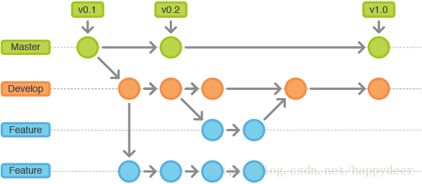

# git 命令

## 常用命令

```shell
git remote -v                              // 查看所有远程分支地址
git remote set-url origin [分支名]            // 修改指定分支的远程地址
git push origin :[分支名]                    // 删除远程分支
git checkout -b [分支名]  origin/[远程分支名]   // 根据远程分支创建一个本地分支
git reflog --date=local | grep [分支名]       // 查看当前分支从基于哪个分支创建的
git reset —-hard [commit id]                // 回退到指定版本

git diff --name-status commitId1 commitId2  // 显示2个commit之间的差异
git diff --name-status branchName          // 查看当前分支与目标分支的差异

git tag -a 1.0.0 -m 'v1.0.0'              // 创建tag
git push --tags                          // push 创建的tag
```

## git 工作流程

[工作流程详解](https://www.cnblogs.com/jeffery-zou/p/10280167.html)



开发新功能时从 dev checkout 一个新分支 feature ， 在 feature 分支上开发好功能之后，
发布测试就合并到 dev

```shell
dev: git merge feature
```

将 feature 分支的内容合并到 dev 分支测试完成之后，再将 dev 分支的内容合并到 master

```shell
master: git merge dev
```
