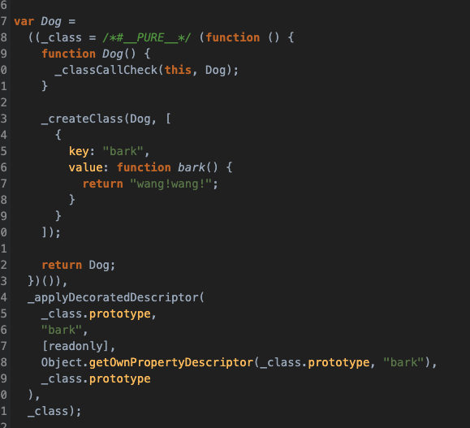
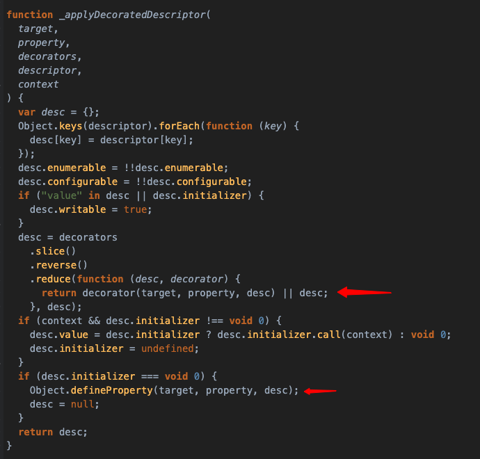

# 装饰器

decorator 装饰器是用来注释或修改类和类方法的一种语法。

```js
@testable // 标记当前类是测试类
class Foo {
  @enumerable(true) // 当前方法可枚举
  method() {}
}
```

## 类的装饰

通过装饰器可以给类添加一些属性：

```js
function testable(target) {
  target.isTest = true;
}

@testable
class Foo {
  // ...
}

Foo.isTest; // true
```

如上代码, `@testable` 装饰器给类 `Foo` 添加了一个静态属性 `isTest`,
装饰器的第一个参数 `target` 就是类 `Foo` 它本身。

上面的代码可以看作如下：

```js
@testable
class Foo {}

// 等同于
calss Foo {}
Foo = testable(Foo) || Foo;
```

装饰器其实就是一个对类进行处理的函数而已，第一个参数就是这个被装饰的目标类;

## 给装饰器传参

```js
function testable(isTest) {
  // 装饰器内返回一个函数
  return function (target) {
    target.isTest = isTest;
  };
}
@testable(true)
class Foo {}
```

通过给装饰器传参，我们可以用来扩展类的方法，比如：

```js
function mixins(...funs) {
  return function (target) {
    Object.assign(target.prototype, ...funs);
  };
}

class Foo {
  say() {
    console.log("hello");
  }
}

@mixins(Foo)
class MyClass {}
let mycls = new MyClass();
mycls.say(); // hello
```

## 方法的装饰

装饰器不仅可以装饰类，还能够装饰类的属性

```js
function reayonly(target, name, descriptor) {
  // 修改被装饰的属性为只读
  descriptor.writable = false;
  return descriptor;
}

class Person {
  @reayonly
  hello() {
    return "你好";
  }
}
let p = new Person();
p.name = "haha"; // Error
```

此时 `Person` 类的 `hello` 属性不能被赋值， 装饰器 `reayonly` 接收三个参数：

- target: 类的原型对象，此处是 `Person.prototype`
- name: 属性名，此处是 `name`
- descriptor: 当前属性的描述

```js
reayonly(Person.prototype, "name", descriptor);
// 等同于
Object.defineProperty(Person.prototype, "name", descriptor);
```

## 装饰器原理

装饰器的原理其实就是利用 `Object.defineProperty()` 方法来实现的：

```js
const desc = decorator(target, property, descriptor) || descriptor;
Object.defineProperty(target, property, desc);
```

装饰器返回新的描述对象，然后重新赋值

附上编译后的 ES5 代码:





## 装饰器不能用于函数

装饰器之能用于类和类的方法，不能用于函数，因为存在函数提升

```js
var counter = 0;

var add = function () {
  counter++;
}

@add
function Foo {}

```

忽略报错提示，按愿意，counter 应该等于 1 ，但其实 counter 还是 0，因为上面代码转换一下如下：

```js
var counter;
var add ;

@add
function Foo () {}

counter = 0;

add = function () {
  counter++
}

```
