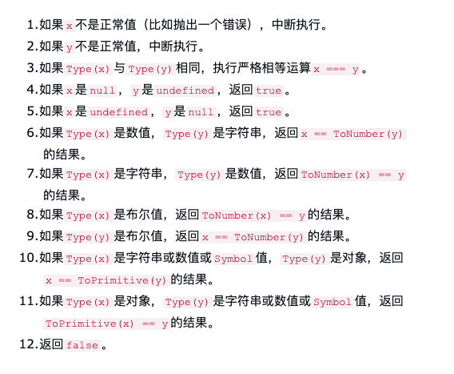

# 概述

规格文件是计算机语言的官方标准，是用来描述**语法规则**和**实现方法**；
通过阅读规格文件，我们能够弄清楚 `JavaScript` 一些语法的实现原理。

[ECMAScript 6 规格官方文档](http://www.ecma-international.org/ecma-262/6.0/)

## 术语

ES6 规格使用了一些专门的术语，了解这些，能够帮助你更好的读懂规格

## 抽象操作

所谓**抽象操作（abstract operations）**就是引擎的一些内部方法，外部不能调用，顾名思义，
它是抽象操作，只定义了行为，具体留给各种引擎去自己实现.

拿 Boolean(value) 的算法来说，第一步如下：

> Let `b` be `ToBoolean(value)`

这里 `ToBoolean` 是一个抽象操作，是引擎内部求出布尔值的算法

## Record 和 field

ES6 规格将**键值对（key-value map）**的数据结构成为 `Record` ，其中每一组键值对成为 `field`
而每一个 `field` 包含一个键名（key）和一个键值（value）

## [[Notation]]

类似于 `[[Notation]]` 这种书写手法的，用它来指代 `field` 的键名,
例如 ES6 中的 `[[value]]、[[Get]]、[[Set]、[[Writable]]`

举例，obj 是一个 Record，它有一个 Prototype 属性，ES6 不会写成 obj.Prototype,而是写成 obj.[[Prototype]].
一般来水，使用 `[[Notation]]` 这种书写的属性，都是对象的内部属性:

## Completion Record

每一个语句都会返回一个 Completion Record ，表示运行结果。每个 Completion Record 有一个 [[Type]] 属性，
表示运行结果的类型，[[Type]] 属性有 5 中可能的值:

- normal
- return
- break
- continue
- throw

[[Type]] 的值为 normal 时称为 normal completion 表示运行正常，其他的值都称为 abrupt completion,

## 抽象操作的标准流程

如下规格代码：

1. Let `result` be `AbstractOp()`.
2. If `result` is an abrupt completion, return `result`.
3. Set `result` to `result.[[Value]]`.
4. return `result`.

第一步调用抽象操作 `AbstractOp()`，得到 `result`；如果 `result` 属于 `abrupt completion`,则直接返回；
否则属于 `normal completion`。第三部将 `result` 的值设置为 `resultAbruptCompletion.[[Value]]`，
第四步，返回 `result`.

## == 运算符的规格（参考）

