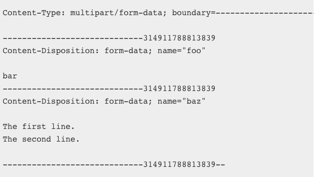

# Ajax

## Asynchronous JavaScript and XML

Ajax 不是一项新的技术，只是用来实现网页与服务端异步通信的一种方式，基于 XMLHttpRequest 来实现
老版本的 IE 则使用 ActiveXObject 来实现

## Ajax 实现步骤

- 创建 XMLHttpRequest 实例
- 监听相应的回调事件
- 调用 open() 方法打开一个 URL
- 调用 send() 方法，发送请求

## XMLHttpRequest 相关属性

- **readyState** 当前请求所处的状态

  | 值  | 状态             | 描述                                                                     |
  | --- | ---------------- | ------------------------------------------------------------------------ |
  | 0   | UNSENT           | 请求被创建，但还未调用 `open()` 方法                                     |
  | 1   | OPENED           | `open()` 方法已被调用，此时可以设置通过 `setRequestsHeader()` 设置请求头 |
  | 2   | HEADERS_RECEIVED | `send()` 方法被调用                                                      |
  | 3   | LOADING          | 数据正在传输，`responseText` 属性已包含部分数据                          |
  | 4   | DONE             | 数据传输已经完成或失败                                                   |

- onreadystatechange 监听请求状态的改变

  > 只要 `readyState` 值发生变化，就触发 `onreadystatechange` 事件 ，此属性不适用同步的请求，
  > 且当一个请求被 `abort()` 取消时，不会触发 `onreadystatechange` 事件

- responseType 与 response 对应关系

  | responseType   | response    | response 说明                                |
  | -------------- | ----------- | -------------------------------------------- |
  | 空字符串(默认) | DOMString   | 同设置 text 相同                             |
  | text           | DOMString   | 返回文本类型                                 |
  | arraybuffer    | ArrayBuffer | 返回一个包含二进制数据的字节数组 ArrayBuffer |
  | blob           | Blob        | 返回一个包含二进制数据的 Blob 对象           |
  | document       | Document    | HTML Document 和 XML XMLDocument 对象        |
  | json           | json        | 返回一个 JavaScript 的 JSON 对象             |

- timeout 请求超时时间

## send()

用于发送 http 请求，接受一个可选的参数作为请求的主体，如果是 GET or HEAD 请求，则传入 null

## 语法

- XMLHttpRequest.send()
- XMLHttpRequest.send(ArrayBufferView Data)
- XMLHttpRequest.send(Blob Data)
- XMLHttpRequest.send(Document Data)
- XMLHttpRequest.send(DOMString? Data)
- XMLHttpRequest.send(FormData Data)

## overrideMimeType()

重写服务器返回的 MIME 类型，比如服务器返回的 MIME 类型是 text/plain ,
但实际返回内容包含 xml, 则此时可以通过 xhr.overrideMimeType('text/xml')
将返回数据当做 xml 来处理

## abort()

终止当前执行的请求，当一个请求被终止时，readyState 会重置为 0（UNSENT)

## XMLHttpRequest 事件

| 事件               | 描述                                                                                         |
| ------------------ | -------------------------------------------------------------------------------------------- |
| loadstart          | 程序加载时触发                                                                               |
| load               | 当一个请求完成时会被触发,不管是成功还是失败                                                  |
| onreadystatechange | 每当 readyState 改变时就会触发                                                               |
| loadend            | 当一个请求或资源加载停止是触发（当触发 error、abort、或 load 事件之后，会触发 loadend 事件） |
| progress           | 请求接收到数据时，被周期性触发(常用于上传或者下载时监测进度)，需要在 open() 方法调用之前监听 |
| timeout            | 请求超时时触发                                                                               |
| error              | 请求遇到错误时触发                                                                           |
| abort              | 请求终止时触发                                                                               |

## 表单提交的 4 种方式

| 方法 | 编码类型                        | 描述               |
| ---- | ------------------------------- | ------------------ |
| POST | application/www-form-urlencoede | url 编码(默认)     |
| POST | text/plain                      | 文本类型           |
| POST | multipart/from-data             | 多表单形式（文件） |
| GET  | -                               | -                  |

- POST Content-Type: application/www-form-urlencoded

> name=%E5%93%88%E5%93%88&age=10

- POST Content-Type: text/plain

> name=哈哈
> age=10

- POST Content-Type: multipart/form-data



- GET 这里就不必多说了

## FormData 对象的使用

通过 FormData 对象构造一个表单数据对象，通过它的 append 方法，添加 key-value

```js
var data = new FormData();
// 添加字符串
data.append("name", "haha");
// 这里数字会转化成字符串 ‘10’
data.append("age", 10);
// 这里通过 <input type='file' /> 选择文件来上传
data.append("file1", fileInputElement.files[0]);

// 手动创建一个Blob 对象
var content = '<a id="a"><b id="b">hey!</b></a>'; // 文件的内容
var blob = new Blob([content], { type: "text/xml" });
data.append("blob", blob);

var xhr = new XMLHttpRequest();
xhr.open("POST", "http://www.example.com/upload");
xhr.send(data);
```

FormData.append() 方法可以添加 Blob, File 和 String 类型的数据,如果其他类型不是
Blob 和 File 将会被转化成字符串

> Blob 表示一个不可变的，原始数据的类似文件对象，另外 `append()` 方法的第三个参数
> 可以设置发送请求头 `Content-Dispostion` 指定文件名
> `data.append('blob', blob, 'filename.txt')`

还可以通过直接传入一个表单对象初始化 FormData 实例

```html
<form name="myform" enctype="multipart/form-data" method="post">
  <input type="text" name="uname" />
  <input type="number" name="age" />
  <input type="file" name="file" />
  <input type="submit" value="提交表单" />
</form>
```

拦截表单提交，并且手动添加一些额外的参数

```js
var form = document.forms.namedItem("myform");
// 拦截表单默认的提交
form.addEventListener("submit", function (e) {
  var data = new FormData(form);
  data.append("other", "1223");

  var xhr = new XMLHttpRequest();
  xhr.open("POST", "http://www.example.com/upload");
  xhr.send(data);
  e.preventDefault();
});
```

> 如果 FormData 是通过表单创建的，则表单中指定的请求方式会被应用到 open() 中

## navigator.sendBeacon(url, data)

常用于在页面卸载时，向服务器异步发送少量的数据。也可设置
XMLHttpRequest.open('GET', '/log', false) 方法的
第三个参数为 false ，来让 XMLHttpRequest 同步发送请求，
但是这样会导致非常差的页面载入性能，但是 navigator.sendBeacon 方法是异步的，
就没有这个问题

## SSE (Server-Sent-Event) 推送消息

单向通信，服务端向客户端推送消息，客户端不能向服务端发送请求;
服务器相应的类型必须是 text/event-stream ;
断开连接时能自动重连

```js
var es = new EventSource(url); // url 需要与创建 EventSource 对象的页面同源
// 建立连接时触发
es.onopen = function (event) {
  console.log(event.data); // data 中保存服务器返回的数据
};
// 接收到服务器返回的消息时触发
es.onmessage = function (event) {
  console.log(event.data); // data 中保存服务器返回的数据
};
// 无法建立连接时触发
es.onerror = function (event) {
  es.close(); // 关闭连接，EventSource 将不会因断开连接而重连
};
```

服务端如何发送消息，下面以 node 为例:

```js
var http = require("http");
http
  .createServer((res, req) => {
    res.writeHead(200, {
      "Content-Type": "text/event-stream",
      "Cache-Control": "no-cache",
      Connection: "keep-alive",
      "Access-Control-Allow-Origin": "*",
    });
    res.write("retry: 1000\n"); // 通过 retry 字段指定浏览器重新发起连接的时间间隔
    res.write("event: ping\n"); // 发送一个自定义 ping 事件
    res.write("data: hello world\n\n"); // 发送一条消息内容为 hello wrold
    res.write("data: 另外一条数据\n\n"); // 再发送一条消息
  })
  .listen(3000);
```
