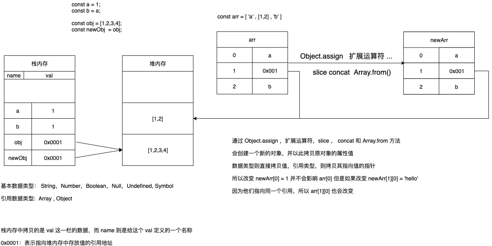
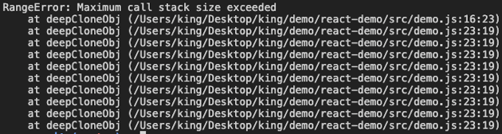

# 深拷贝和浅拷贝

## 定义

在 JavaScript 中，对于数据的拷贝分为两种情况:

- 拷贝基本数据类型: 拷贝的是值
- 拷贝引用数据类型: 拷贝的是指向值的指针

而对于 **引用数据类型** 又分为 **深拷贝** 和 **浅拷贝**：

### 浅拷贝

其实就是拷贝对象的引用，当改变一个对象的属性值，则被拷贝对象的相同属性的值也会发生改变

### 深拷贝

则是拷贝这个对象的实例，其实也就是根据这个对象，重新创建一个新的对象，两者毫无相干；



## 引用类型的深拷贝

### Object 和 Array

```js
const target = {
  a: 'a',
  b: {
    age: 10
  },
  c:[1,2]
}
/**
 * 深拷贝
 * - 如果是基本类型，直接返回值
 * - 如果是引用类型，则递归知道属性为基本类型为止
 * @param {*} target
 */
function deepCloneObj (target) {
  if(typeof target !== 'object') {
    return target;
  }
  const result = Array.isArray(target) ? [] : {};
  for(const key in target) {
    result[key] = deepCloneObj(target[key])
  }
  return result;
 }
}
```

上述代码虽然可以实现 Object 和 Array 的深拷贝，但是如果其引用属性引用了自身：

```js
target.obj = target;
```

变回造成调用栈超出限制的错误



## 解决 Object 的循环引用问题

```js
/**
 * 深拷贝
 * - 如果是基本类型，直接返回值
 * - 如果是引用类型，则递归知道属性为基本类型为止
 * @param {*} target
 * @param {*} weakMap
 */
function deepCloneObj(target, weakMap = new WeakMap()) {
  if (typeof target !== "object") {
    return target;
  }
  const result = Array.isArray(target) ? [] : {};

  const value = weakMap.get(target);
  if (value) {
    return value;
  }
  weakMap.set(target, result);

  for (const key in target) {
    result[key] = deepCloneObj(target[key], weakMap);
  }
  return result;
}
```

通过添加 WeakMap 对象，保存当前对象 target 和拷贝对象 result 之间的关系，
如果当前对象之前拷贝过，则直接返回拷贝的对象

## 几种深拷贝的实现

### Date

```js
function deepCloneDate(target) {
  const Ctor = target.contructor;
  return new Ctor(target);
}
```

### Function

lodash 中对函数的的拷贝：如果是函数，则直接返回

```js
const isFunc = typeof value === "function";
if (isFunc || !cloneableTags[tag]) {
  return object ? value : {};
}
```

### RegExp

```js
function deepCloneRegExp(regexp) {
  const regFlag = /\w*$/;
  const result = new regexp.constructor(regexp.source, regFlag.exec(regexp));
  result.lastIndex = regexp.lastIndex;
  return result;
}
```

### Symbol

```js
function deepCloneSymbol(targe) {
  return Symbol.prototype.valueOf.call(targe);
}
```

## JS 自带的浅拷贝方法

- Object.assign
- ES6 扩展运算符 {...}
- JSON.parse 和 JSON.stringify
- Array.from
- Array.concat
- Array.slice

## 如何实现真正的深拷贝？

```js
/* eslint-disable default-case */
const target = {
  a: "a",
  b: {
    age: 10,
  },
  c: [1, 2],
  e: function () {
    return "e";
  },
  f: Symbol("f"),
  g: null,
  h: undefined,
  i: new Date(),
  j: /foo/i,
  k: false,
};
target.obj = target;

function includesTag(tag) {
  return ["[object Date]", "[object RegExp]", "[object Symbol]"].includes(tag);
}

function cloneRegExp(value) {
  const regFlag = /\w*$/;
  const result = new value.constructor(value.source, regFlag.exec(value));
  result.lastIndex = value.lastIndex;
  return result;
}

function cloneByTag(value, tag) {
  switch (tag) {
    case "[object Date]":
      const Ctor = value.constructor;
      return new Ctor(value);
    case "[object RegExp]":
      return cloneRegExp(value);
    case "[object Symbol]":
      return Symbol.prototype.valueOf.call(value);
  }
}

function isObject(value) {
  const type = typeof value;
  return value !== null && (type === "object" || type === "function");
}
function isFunction(value) {
  return typeof value === "function";
}

function getType(value) {
  return Object.prototype.toString.call(value);
}

/**
 * 深拷贝
 * - 如果是基本类型，直接返回值
 * - 如果是引用类型，则递归知道属性为基本类型为止
 * @param {*} value
 * @param {*} weakMap
 */
function deepClone(value, weakMap = new WeakMap()) {
  const tag = getType(value);
  if (includesTag(tag)) {
    return cloneByTag(value, tag);
  }

  if (!isObject(value) || isFunction(value)) {
    return value;
  }

  const result = Array.isArray(value) ? [] : {};
  const mapValue = weakMap.get(value);
  if (mapValue) {
    return mapValue;
  }
  weakMap.set(value, result);

  for (const key in value) {
    result[key] = deepClone(value[key], weakMap);
  }
  return result;
}

const cloneObj = deepClone(target);
console.log(target);
console.log(cloneObj);
```

以上代码只实现了` Object , Array, Function, Date , RegExp, Symbol` 的深拷贝
对于其他数据类型如 `Map, Set` ，这里就不再实现，原理类似，有兴趣的可以自己实现看看
