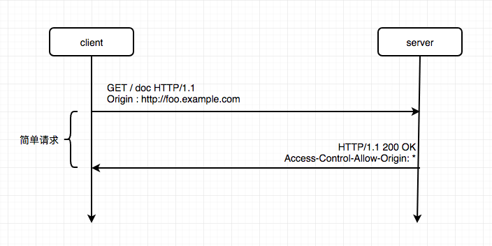
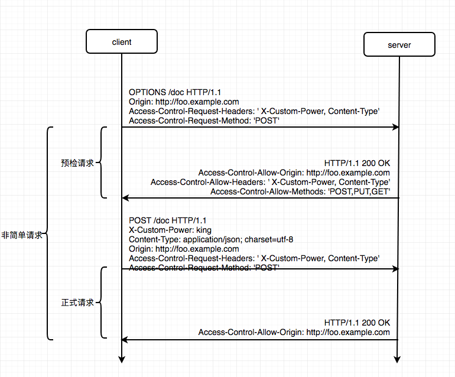

## 同源策略

由于浏览器的同源策略，不允许浏览器进行跨域请求，所谓同源就是协议，域名，端口三者都相同。

#### 同源策略的限制

一下功能受到同源策略的限制，不能在非同源情况下访问

- `Cookie、LocalStorage、IndexedDB`
- `DOM` 节点
- `Ajax` 请求发送后，返回的结果会被浏览器拦截

#### 不受同源策略限制的标签

- ``
- `<link src='xxx'/>`
- `<script src='xxx'/>`

跨域请求不是请求发布出去，而是请求可以发送，并且服务器也能正确接收并返回，但是在返回时被浏览器拦截了；
而通过表单却可以发起跨域请求，而 `ajax` 却不行？那是因为如果跨域请求可以访问其他域的内容，
并且 `ajax` 可以响应返回的内容（如果其他域的内容是不安全的，或者是木马），所以浏览器认为这不安全，进行了拦截。
但是表单却不会获取请求的内容，所以可以发起跨域请求，但是前面说了，跨域请求服务端可以接收，所以还是存在安全隐患

## CORS 跨域资源共享

`CORS` 需要浏览器和服务器同时支持，目前所有浏览器都以支持该功能(IE10+);
整个 CORS 通信过程是浏览器自动完成的，浏览器一旦发现 `AJAX` 发送的是跨域请求，
会自动附加一些头信息，有时候还会多发起一次请求（`OPTIONS` 请求）

**CORS** 请求分为： 简单请求 和 非简单请求

### 简单请求

同时满足下面 2 大条件就属于简单请求

1. 请求方法是下列方法之一:

   - HEADER
   - GET
   - POST

2. HTTP 头信息包含不超出以下几种字段

   - Accept
   - Accept-Language
   - Content-Language
   - Content-Type: 仅限于以下三个值
     1. application/x-www-form-urlencoded
     2. multipart/form-data
     3. text/plain
   - Width
   - DPR

```js
var xhr = new XMLHttpRequest();
xhr.addEventListener("load", (e) => {
  console.log(xhr.getAllResponseHeaders());
});

xhr.open("get", "http://192.168.4.100:3000/query");

xhr.setRequestHeader("Accept", "all");
xhr.setRequestHeader("Accept-Language", "zh-cn");
xhr.setRequestHeader("Content-Language", "zh-cn");
xhr.setRequestHeader("Content-Type", "text/plain");
xhr.setRequestHeader("Width", "1");
xhr.setRequestHeader("DPR", "1");

xhr.send(null);
```

如上代码，HTTP 的请求头只包含上面列举的 6 个请求头时，只会发送简单请求，除以上情况以外，会发送非简单请求，
且在发送非简单请求之前，会增加一次 `HTTP` 查询请求，称为 预检请求（方法名: `OPTIONS`）



### 非简单请求

上述代码增加 2 个请求头设置：

```js
// 自定义请求头
xhr.setRequestHeader("X-Custom-Power", "kaige");
// 修改 Content-Type 的类型
xhr.setRequestHeader("Content-Type", "application/json");
```

此时浏览器在发出正式的请求之前，会先发送一次预检请求，预检请求的部分头信息如下：

> Access-Control-Request-Headers: content-type, x-custom-power
> Access-Control-Request-Method: GET
> Cache-Control: no-cache
> Connection: keep-alive
> Host: 192.168.4.100:3000
> Origin: chrome-search://local-ntp



#### 预检请求的回应

服务器收到预检请求后，检查 `Origin、Access-Control-Request-Method` 和 `Access-Control-Request-Headers`
字段以后，确认允许跨域请求，做出相应回应,下面以 `node` 为例：

```js
app.all("*", (req, res, next) => {
  // 此处允许任意跨域请求
  res.setHeader("Access-Control-Allow-Origin", "*");
  // 自定义的请求头 X-Custom-Power,Content-Type
  res.setHeader("Access-Control-Allow-Headers", "X-Custom-Power,Content-Type");
  // 允许跨域的方法
  res.setHeader("Access-Control-Allow-Methods", "PUT,GET");
  next();
});
```

### 请求头 和 响应头

请求头

- Origin

> 此字段是浏览器自动添加的,如果 `Origin` 指定的源不在许可范围内，服务器会正常返回一个 HTTP 请求，
> 如果响应头中没有 `Access-Control-Allow-Origin` 字段且与 `Origin` 指定的源不匹配（包含关系），
> 则浏览器就知道报错了，会抛出一个错误，这个错误会被 `XMLHttpRequest` 的 `onerror` 回调函数捕获
> 注意这种错不能通过 HTTP 状态吗来判断，因为 HTTP 响应码可能是 200

- `Access-Control-Request-Headers` （预检请求中有）

> 指定浏览器的 CORS 请求会会额外发送的 HTTP 头信息字段，通过 `xhr.setResponseHeader()` 设置

- `Access-Control-Request-Method`（预检请求中有）

> 指定浏览器的 CORS 请求会用到哪些 HTTP 方法，这里是 `GET`

正因为预检请求中包含了 `Access-Control-Request-Headers` 和 `Access-Control-Request-Method `
服务端才方便设置允许可以跨域的请求头和方法

响应头

- Access-Control-Allow-Origin

> 设置允许跨域请求的地址（如：`http://www.example.com`），设置为 `*` 号表示允许任意的跨域请求

- Access-Control-Allow-Headers

> 如果浏览器发起的请求头中包含 `Access-Control-Request-Headers` 字段，则 `Access-Control-Allow-Headers `
> 字段是必须的，表明服务器支持的所有请求头信息字段，不限于预检请求中请求的字段

- Access-Control-Allow-Methods

> 表明服务器支持的所有跨域请求的方法，注意返回的是所有支持的方法，而不是浏览器请求的那个方法，防止多次发起预检请求

- Access-Control-Max-Age

> 可选，弱本次预检请求有效，这只有效期时间，单位秒，在这期间，不用再次发起预检请求

- Access-Control-Allow-Credentials

> 表示是否允许发送 `cookie`。默认情况下 `cookie` 不包含在 `CORS` 请求中，设置为 `true`，表示服务器
> 明确许可 `cookie` 可以包含在 `CORS` 请求中一起发送到服务器，并且需要浏览器端设置
> `XMLHttpRequest` 对象的 `withCredentials` 属性为 `true`, 允许浏览器发送 `cookie`，否则不会处理。

- Access-Control-Expose-Headers

可选，发送 `CORS` 请求时， `XMLHttpRequest` 对象的 `getResponseHeader()` 方法，只能拿到 6 个响应头信息:

1.  Cache-Control
2.  Content-Language
3.  Content-Type
4.  Expires
5.  Last-Modified
6.  Pragma

如果想要拿到其他的响应头信息，需要通过 `Access-Control-Expose-Headers` 来指定：

> `Access-Control-Expose-Headers: 'ETag,Date,X-Custom-Power'`

`X-Custom-Power` 为服务端自定义的头信息

## 其他解决跨域方案

#### img

`img` 标签不受跨域影响

```js
var img = new Image();
img.onload = function () {};
img.onerror = function () {};
// 通过设置 src ，访问其他网站的链接
img.src = "http://www.it3315.com/example?name=123";
```

但是这种方式只能用于浏览器与服务器单向通信，因为它不能接收到服务器响应的文本，
但是由于浏览器的 COBR 限制，并不能访问到

#### JSONP（需要服务端支持）

`jsonp` 只支持异步的 `get` 请求，不支持 `post`,有一定的局限性

```js
function handleResponse(res) {
  console.log(res);
}
var script = document.createElement("script");
script.src = "http://192.168.4.100:3000/query?callback=handleResponse";

document.body.append(script);
```

服务端响应 jsonp 请求

```js
app.get("/query", (req, res) => {
  const { callback } = req.query;
  if (callback) {
    // 针对jsonp请求的特殊处理
    res.end(`${callback}('jsonp success')`);
  } else {
    res.send({ data: "hello world" });
  }
});
```

#### Node 中间代理

**同源策略** 是浏览器需要遵循的标准，但如果是服务器向服务器发送请求，就没有这个限制，通过 `Node` 中间服务
转发浏览器发送的请求到目标服务器，获取数据之后，再返回给浏览器即可

#### Nginx 反向代理

通过 `nginx` 反向代理实现跨域是最简单的跨域方式
