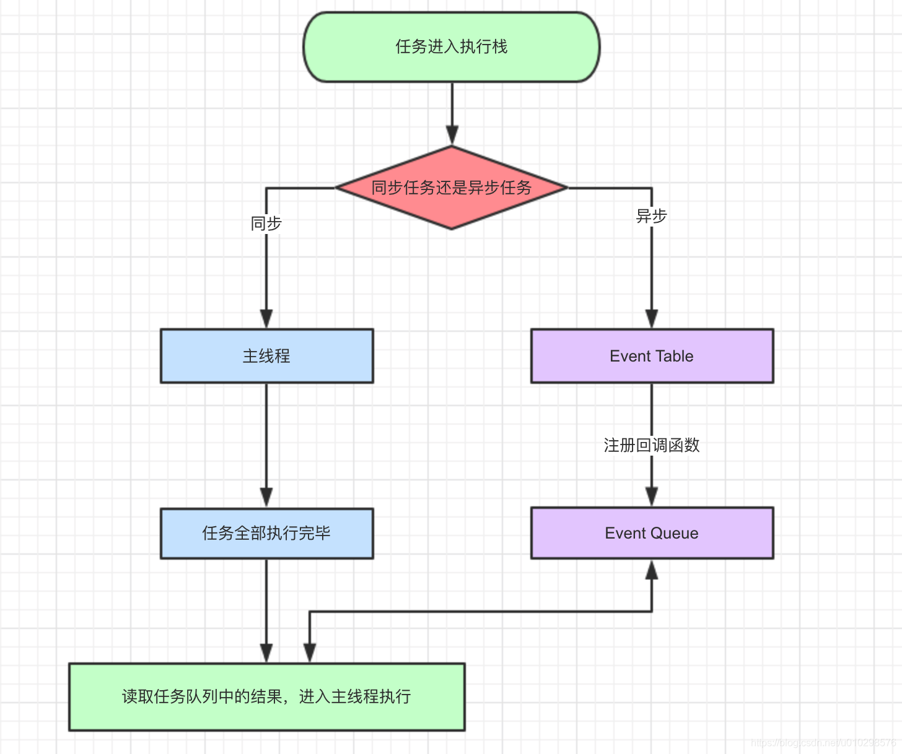
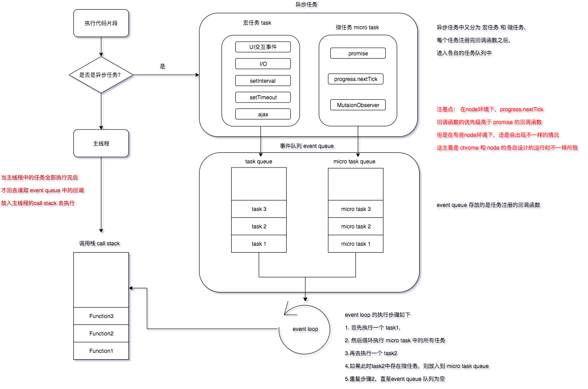
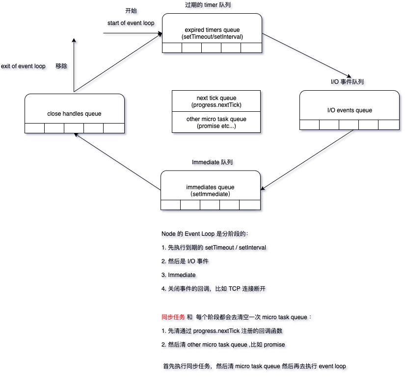

# Event Loop

JavaScript 是一个单线程语言，也就是说所有的任务必须一个一个排队执行，
但是如果一个任务执行时间过长，便会阻塞后面的任务执行，
因此需要将耗时时间长的任务作为异步任务来处理，以防止主线程阻塞，
于是便有了 `Event Loop` 这个 **执行机制**

js 具体执行过程如下:



当执行到 `setTimeout(fn , 1000)` 或 `setTimeout(fn , 0)` 时，
它会被放入 Event Table 中注册回调函数，再经过 1000ms 或 0 毫秒时（实际最小延迟为 4ms），回调函数被放入 `Event Queue` ,记住只有当主线程中的任务全部执行结束之后，
才会去读取 `Event Queue ` 中的回调结果，并放入到主线程中去执行

异步任务还有更细分的定义：

- 宏任务: 代码块，`setImmediate, setTimeout, setInterval, I/O, UI交互事件`
- 微任务: `Promise, progress.nextTick MutaionObserver`

另外 `new Primise()` 会立即调用里面的回调函数，应该属于同步任务

Event Queue 中对于所有任务的执行循序是:


1. 先执行代码块（主程序中的任务，个人理解是先执行所有的同步任务）；
2. 然后开始执行队列中所有的微任务，
3. 然后再次执行下一个宏任务，
4. 然后重复第 2 步，直至任务队列为空

```js
console.log("1");

// setTimeout1
setTimeout(function () {
  console.log("2");
  // promise1
  new Promise(function (resolve) {
    console.log("3");
    resolve();
  }).then(function () {
    console.log("4");
  });
});
// promise
new Promise(function (resolve) {
  console.log("5");
  resolve();
}).then(function () {
  console.log("6");
});

// setTimeout2
setTimeout(function () {
  console.log("7");
  // promise2
  new Promise(function (resolve) {
    console.log("8");
    resolve();
  }).then(function () {
    console.log("9");
  });
});
```

根据上面的代码，分析执行步骤（chrome 环境中）：

1. 首先执行整体代码（主线程中的任务）

```js
console.log(1);
promise;
// 输出 1，5
```

2. 然后开始执行队列中的微任务

```js
promise.then;
// 输出 6
```

3. 然后再执行下一个宏任务 **setTimeout1**

```js
console.log("2");
promise1;
// 输出 2，3
```

4. 然后再执行 **setTimeout1** 代码块中的微任务

```js
promise1.then;
// 输出 4
```

5. 然后再执行下一个宏任务 **setTimeout2**，此步骤跟 **步骤 3** 同理:
   > 输出 7,8,9

所以最终输出结果是: 1,5,6,2,3,4,7,8,9

#### 思考下面这段代码的输出

```html
<div class="outer">
  <div class="inner"></div>
</div>
```

```js
// Let's get hold of those elements
var outer = document.querySelector(".outer");
var inner = document.querySelector(".inner");

// Let's listen for attribute changes on the
// outer element
new MutationObserver(function () {
  console.log("mutate");
}).observe(outer, {
  attributes: true,
});

// Here's a click listener…
function onClick() {
  console.log("click");

  setTimeout(function () {
    console.log("timeout");
  }, 0);

  Promise.resolve().then(function () {
    console.log("promise");
  });

  outer.setAttribute("data-random", Math.random());
}

// …which we'll attach to both elements
inner.addEventListener("click", onClick);
outer.addEventListener("click", onClick);
```

当点击 inner div 时:

1. 执行 `onClick` 回调执行: `console.log('click')`;
2. 然后执行微任务队列中的回调执行: `console.log('promise'); console.log('mutate')`;
3. 由于 onClick 事件冒泡机制，再次执行 onClick (outer div 的点击事件),执行: `console.log('click')`;
4. 然后再次执行微任务队列中的回调： `console.log('promise'); console.log('mutate')`;
5. 然后再执行 setTimeout

所以输出结果为: `onClick,promise,mutate,onClick,promise,mutate,timeout,timeout` ，其他浏览器会有差异
具体执行过程，查看这篇文章中的例子 [Tasks, microtasks, queues and schedules](https://jakearchibald.com/2015/tasks-microtasks-queues-and-schedules/) 有详细的执行步骤介绍

## 自己的理解



## Node 环境

如果我们将上面的代码加入 progress.nextTick 放入到 node 环境中去执行，又会输出什么呢?

```js
console.log("1");

// setTimeout1
setTimeout(function () {
  console.log("2");
  // promise1
  new Promise(function (resolve) {
    console.log("4");
    resolve();
  }).then(function () {
    console.log("5");
  });
  // process.nextTick1
  process.nextTick(function () {
    console.log("3");
  });
});

// promise
new Promise(function (resolve) {
  console.log("7");
  resolve();
}).then(function () {
  console.log("8");
});
// process.nextTick
process.nextTick(function () {
  console.log("6");
});

// setTimeout2
setTimeout(function () {
  console.log("9");
  // promise2
  new Promise(function (resolve) {
    console.log("11");
    resolve();
  }).then(function () {
    console.log("12");
  });
  // process.nextTick2
  process.nextTick(function () {
    console.log("10");
  });
});
```

原本以为按照上面的逻辑，可以得出结果输出：1,7,8,6,2,4,5,3,9,11,12,10

但是马上执行一遍确又啪啪打脸啊，直接输出为：1,7,6,8,2,4,3,5,9,11,10,12

通过对比结果，发现 `progress.nextTick` 的优先级高于 `promise`

> **以上代码我是在 node 版本 v12.10.0 上测试的，但是在 v10.15.3 上测试，会发现输出：** > **1,7,6,8,2,4,9,11,3,10,5,12** > **但是如果将第二个 setTimeout 设置延迟超过 1ms， 结果又会跟在版本 v12.10.0 上输出的一致 **

我擦，这是个什么鬼，是不是有点懵逼,通过上面输出结果可以知道，当 `setTimeout` 延时相同，他们会合并（姑且这么理解）：
用代码来解释如下：

```js
setTimeout(function () {
  console.log("2");
  // promise1
  new Promise(function (resolve) {
    console.log("4");
    resolve();
  }).then(function () {
    console.log("5");
  });
  // process.nextTick1
  process.nextTick(function () {
    console.log("3");
  });

  console.log("9");
  // promise2
  new Promise(function (resolve) {
    console.log("11");
    resolve();
  }).then(function () {
    console.log("12");
  });
  // process.nextTick2
  process.nextTick(function () {
    console.log("10");
  });
});
```

合并之后，代码放在一起，那么执行的时候输出就是:` 2,4,9,11,3,10,5,12` 因此:

> 当 `setTimeout` 延时相同时，他们会合并在一起执行

#### Node 的 Event Loop 执行机制



## 资料

- [Tasks, microtasks, queues and schedules](https://jakearchibald.com/2015/tasks-microtasks-queues-and-schedules/) 这篇文章不错，多看看
- [Event Loop and the Big Picture](https://blog.insiderattack.net/event-loop-and-the-big-picture-nodejs-event-loop-part-1-1cb67a182810)
- [Timers, Immediates and Process.nextTick](https://blog.insiderattack.net/timers-immediates-and-process-nexttick-nodejs-event-loop-part-2-2c53fd511bb3)
