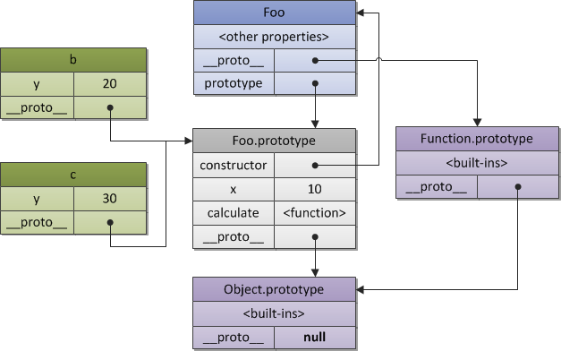

## 原型

每一个 js 对象（null 除外）在创建的时候就会有与之关联的另一个对象，这个对象就是我们所说的原型。
每一个对象会从原型上继承属性

如果是通过对象字面量创建的对象其原型指向 Object.prototype

```js
var p = {
  name: "hello",
};

console.log(p.__proto__ === Object.prototype); // true
```

通过构造函数创建对象,会自动为实例设置原型对象 p.**proto** === Person.prototype

```js
function Person() {}
p.name = "hello";
Person.prototype.name = "world";
console.log(p.name); // hello;
delete p.name;
console.lg(p.name); // world
```

虽然删除了实例上的 `name`, 但是原型上仍然能访问到 `name`


```js
function Person() {}

var p = new Person();

console.log(p.__proto__ === Person.prototype); // true
// 通过ES6提供的 getPrototypeOf 方法获取对象原型
console.log(Object.getPrototypeOf(p) === Person.prototype); // true
console.log(Person === Person.prototype.constructor); // true

console.log(p.constructor === Person); // true
```

通过上面的代码我们可以知道，实例 `p` 的 `__proto__` 属性执向原型对象；
原型对象 `Person.prototype` 上的 `constructor` 属性执向构造函数,

注意最后一行 `p.constructor === Person ` 因为实例 `p` 上面是没有 `constructor` 属性的，
所以就会去它的原型上去找，因为原型 `Person.prototype` 有 `constructor` 属性，
所以 `p.constructor === Person` 成立

一开始说到，每一个对象（null 除外）在创建的时候都会有原型对象，那么 原型对象 是否也有一个自己的原型对象呢？

```js
// 打印 Person.prototype 的原型对象
console.log(Person.prototype.__proto__ === Object.prototype); // true
```

`Person.prototype` 的原型对象其实就是 `Object` 的原型 `Object.prototype`,
而 `Object.prototype` 的原型则为 `null` 表示没有原型，因此查找属性的时候，
查到 `Object.prototype` 也就结束了

#### **proto** （也可[[prototype]]这样表示）

`__proto__` 是一个非标准的方式访问原型，一般我们我们通过 `Object.getPrototypeOf(obj)` 来获取对象的原型

## 原型链



图中构造函数 `Foo` 中的 `__proto__` 属性指向 `Function.prototype`

[CSDN](https://blog.csdn.net/u010298576/article/details/86165783)

## 继承

### 原型链继承

将子类的原型指向父类的实例

```js
function SuperType() {
  this.name = "super";
  this.colors = ["blue", "red"];
}
function SubType() {}
SubType.prototype = new SuperType();
var sub1 = new SubType();
sub1.colors.push("green");
var sub2 = new SubType();
```

#### 缺点

1. 原型中的 **引用类型属性** 是会被所有实例共享的，因此这种继承方式也存在这个问题；这里的 `colors` 属性（也就是 `SubType prototype` 的属性）是被实例 `sub1` 和 `sub2` 共享的对 `sub1.colors` 进行修改，也会影响到 `sub2.colors`

2. 另外不能向超类构造函数中传递参数

### 借用构造函数

通过在子构造函数中调用父类构造函数

```js
function SuperType(name) {
  this.name = name;
  this.colors = ["blue", "red"];
}
function SubType(name) {
  SuperType.call(this, name);
}
var sub1 = new SubType("sub1");
sub1.colors.push("green");
var sub2 = new SubType("sub2");
```

`SuperType.call(this, name)` 中的 `this` 指向的是 `SubType` , 所以父类构造函数中
的属性会被创建在 `SubType` 上, 虽然这种方式，可以实现向父类构造函数中传递参数，但是无法访问
父类原型上的方法，如果方法都定义在构造函数中，那边无法做到函数的复用

### 组合继承(原型连继承+借用构造函数)

组合继承结合原型链继承和借用构造函数两者的优点

```js
function SuperType(name) {
  this.name = name;
  this.colors = ["blue", "red"];
}
SuperType.prototype.getName = function () {
  return this.name;
};
function SubType(name) {
  SuperType.call(this, name);
}
SubType.prototype = new SuperType();

var sub1 = new SubType("sub1");
sub1.colors.push("green");
var sub2 = new SubType("sub2");
```

这种继承方式的缺点在于，无论如何都会调用 2 次父类构造函数:
一次赋值给子类原型时; 一次子类构造函数中
带来了不必要的开销

### 原型式继承（Object.create）

通过 Object.create 将一个对象作为一个新对象的原型，然后创建这个对象的实例返回
这种继承方式和原型链继承没什么差别，也存在相同问题

```js
function create(o) {
  function F() {}
  F.prototype = o;
  return new F();
}
var person = {
  name: "haha",
  colors: ["green", "blue"],
};
var p1 = create(person);
```

### 寄生组合式继承 (最理想的继承方式)

避免了超类构造函数 2 次调用，

```js
// subType   子类构造函数
// superType  超类构造函数
function inherit(SubType, SuperType) {
  var prototype = Object.create(SuperType.prototype);
  prototype.constructor = SubType;
  SubType.prototype = prototype;
}

function SuperType(name) {
  this.name = name;
}

SuperType.prototype.getName = function () {
  console.log(this.name);
};

function SubType(name) {
  SuperType.call(this, name);
  this.age = 10;
}

inherit(SubType, SuperType);
// 等同于
// SubType.prototype = SuperType.prototype;
// SubType.prototype.constructor = SubType;
```
