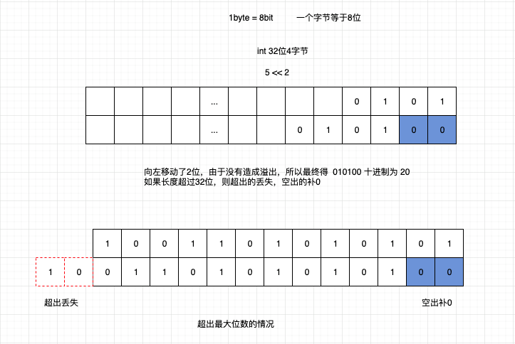

# JavaScript 位运算符

位运算符工作于 32 位的数字上。任何数字操作都将转化为 32 位。结果会转化为 javascript 数字。

| 运算符 | 描述 | 例子       | 类似于       | 结果 | 十进制 |
| ------ | ---- | ---------- | ------------ | ---- | ------ |
| &      | 与   | x = 5 & 1  | 0101 & 0001  | 0001 | 1      |
| \|     | 或   | x = 5 \| 1 | 0101 \| 0001 | 0101 | 5      |
| ~      | 取反 | x = ~5     | ~0101        | 1010 | -6     |
| ^      | 异或 | x = 5 ^ 1  | 0101 ^ 0001  | 0100 | 4      |
| <<     | 左移 | x = 5 << 1 | 0101 << 1    | 1010 | 10     |
| >>     | 右移 | x = 5 >> 1 | 0101 >> 1    | 0010 | 2      |

## & 运算符

运算规则如下（**同 1 为 1，否则为 0**）：

```js
1 & 1 = 1
0 & 0 = 0
1 & 0 = 0
```

## | 运算符

运算规则如下(**有 1 为 1,无 1 为 0**)：

```js
1 | 1 = 1
0 | 0 = 0
1 | 0 = 1
```

## ~ 取反

运算规则如下：

```js
let x = ~5;
// ①将 5 转成二进制： 0101
// ②添加补码（0表示正数，1表示负数）： 0 0101
// ③按位取反： 1 1010

// 转为原码

// ④按位取反(补码不变)： 1 0101
// ⑤末位加1： 1 0110
// ⑥ 符号位是1,所以是个负数 -6
```

> 规律：**~x = -x - 1**

```js
// 正数取反
~5 = -6
~4 = -5
~3 = -4
// 负数取反
~(-5) = 4
~(-3) = 2
~(-2) = 1

```

## ^ 异或

运算规则如下(**相同为 0，不同为 1**)：

```js
1 ^ 1 = 0
0 ^ 0 = 0
1 ^ 0 = 1
```

> 相同的值进行 ^ 运算为 0： 10^10=0 ,所以可以用来消除相同的值：比如，快速找出一组数组中只出现过一次的值

## << 左移 和 >>右移

将二进制向指定方向移动，超过的位丢失，空出的位补 0


