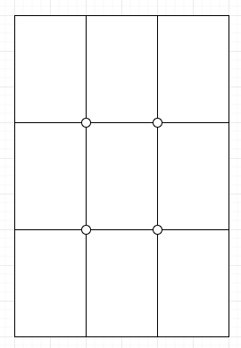
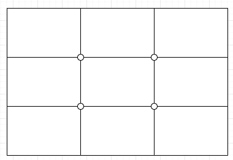
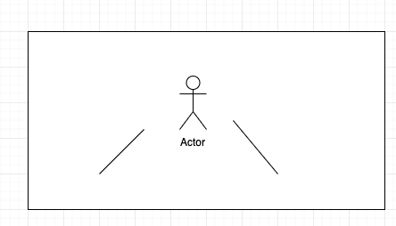

# 手机摄影

## 拍摄视角

通过不同的角度来拍摄

### 成人视角

手持手机跟人眼水平位置

### 小孩视角

以小孩的身高来拍摄，将人带入小孩眼中的世界，给人一种不一样的视觉感受

### 蚂蚁视角

以一个非常低的视角来仰拍，能够体现物体的高大和威严，同时可以近拍，比如拍地上的落叶，水滴等，可以作为很好的开场景

### 上帝视角

利用无人机俯拍

## 景别

一般景别分为 远景，全景，中景，中近景，近景，特写，大特写

### 远景

描述人所处的环境，位置，天气，季节等周围的一个情况

### 全景

画面高度为人的身高差不多，人物在画面中更清晰，可以更好记录人物的肢体动作

### 中景/中近景

人物上半身到大腿全部在画面中，主要表现人物的动作和情绪，突出人物特点，背景会稍微模糊点，更加突出人物

### 近景

从头到胸部，更好的提现人物表情的一些变化，突出人物内心活动等

### 特写

贴的很近，突出人物表情细微的变化

### 大特写

只拍摄一个细节，比如眼睛，嘴巴，流汗等，通过细节来表达

> 可以先通过远景介绍人物所处环境，然后拉中近景，在拉近景，然后眼睛特写

## 前景拍摄关键点

利用前景，突出主体，或者通过前景慢慢过渡到主体，起到一个陪衬的作用

- 前景在画面中不要干扰主体
- 前景的位置不固定，根据环境选择
- 前景选择拍摄环境中自然存在的元素
- 可以借助前景来进行画面转场

## 构图

### 中间构图

人物处于画面的中间

### 九宫格构图

将人物根据环境放置于线的交叉点（4 个点的位置），留出的空白部分，可以更好的提现人物的周围的环境

垂直九宫格

水平九宫格

### 引导线构图

通过周围延伸的线条，来突出人物

### 对称构图

左右对称
