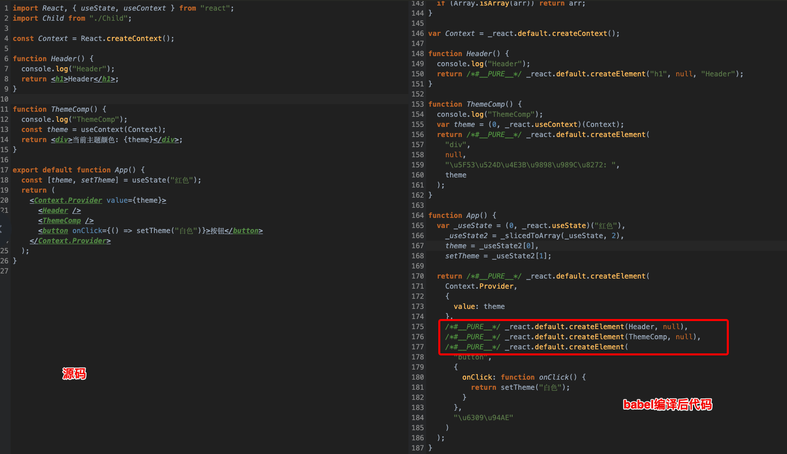
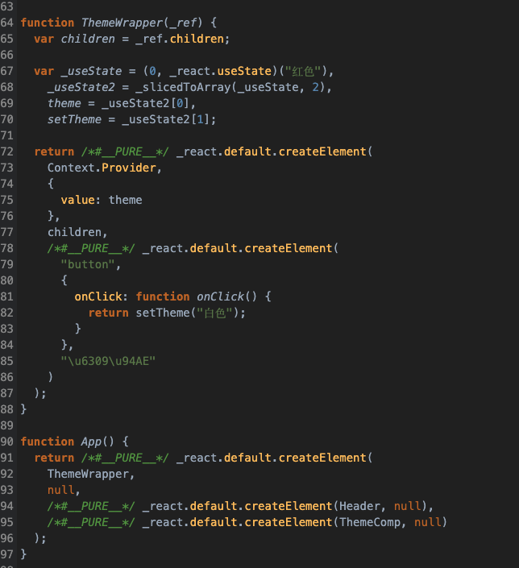

# 组件性能优化

## 减少 render 的次数

如下：父组件中更新 `count`，子组件 `Child` 会重新渲染，其实子组件没有任何数据变动，
按理不应该进行渲染，如果 `Child` 是个很多大的组件，则必然会带来性能问题

**App.jsx:**

```jsx
import React, { useState } from "react";
import Child from "./Child";

export default function App() {
  let [count, setCount] = useState(0);

  const onClick = () => {
    setCount(++count);
  };

  return (
    <div>
      <h1>Count: {count}</h1>
      <Child name="haha" />
      <button onClick={onClick}>button</button>
    </div>
  );
}
```

**Child.jsx:**

```jsx
import React from "react";

function Child({ name }) {
  console.log("child render");
  return <h1>Child组件: {name}</h1>;
}

export default Child;
```

### 使用 React.memo 缓存组件

我们可以通过 `React.memo` 缓存 `Child` 组件,此时更新父组件时，`Child` 便不会再重绘

```jsx
import React from "react";

function Child({ name }) {
  console.log("child render");
  return <h1>Child组件: {name}</h1>;
}

export default React.memo(Child);
```

`React.memo` 只会做浅比较，判断前后 2 次传入 `Child` 的 `name` 是否相同，如果你想要自己控制比较过程，
可以将自定义的比较函数作为第二个参数传入

```jsx
export default React.memo(Child, (preProps, nextProps) => {
  // 返回 true 不渲染，反之则渲染
});
```

### useMemo 更细粒度的控制渲染

```jsx
export default function App() {
  let [count, setCount] = useState(0);

  const onClick = () => {
    setCount(++count);
  };

  // button 组件只会渲染一次
  const button = useMemo(() => <button onClick={onClick}>button</button>, []);
  return (
    <div>
      <h1>Count: {count}</h1>
      <Child name="haha" />
      {button}
    </div>
  );
}
```

### 使用 useCallback 缓存函数引用

先看下面这段代码：

```js
//  子组件
const Child = ({ name, onClick }) => {
  console.log(name);
  return <h1>Child组件: {name}</h1>;
};

export default React.memo(Child);

// 父组件
function App () {
  const [title, setTitle] = useState('旧标题');
  // 箭头函数
  const print = () => {}
  render () {
    return (
      <>
       <h1>{title}</h1>
       <button onClick={() => setTitle('新标题')}>改标题</button>
       <Child name="凯歌" onClick={print} />
      </>
    )
  }
}
```

以上代码，首次运行子组件会打印出 `凯歌` ，这时当我点击 `button` 更新 `title` 时，
此时子组件 `Child` 应该不会被更新，因为传入的 `props` 没有改变，但实际，`Child` 组件还是更新了，
因为传入的 `print` 方法是一个箭头函数，当父组件更新时，`print` 会被重新申明，指向一个新的内存地址，
因此 `React.memo` 浅比较之后认为前后 `print` 不相等，因此重新渲染 `Child` 组件

为了解决这个问题，可以把 print 函数在组件外部申明

```js
const print = () => {};
export default function App() {
  // ...
}
```

或者使用 useCallback 缓存 print 函数引用

```js
const print = useCallback(() => {}, []);
```

如上父组件如何更新，都不会重新导致 `Child` 组件重新渲染

### 避免使用匿名函数

如下代码，`onClick` 被赋值了匿名函数，因此 `Item` 组件的 `onClick` 属性每次都会被赋予不同的引用，
因此造成 `Item` 重复渲染。同理，使用 `useCallback` 解决

```js
const Child = ({list}) => {
  return (
   {list.map( item => (
     <Item name={item.name} onClick={() => handleDelete(item.id)}>
   ))}
  )
}
```

## Context 优化

如下代码，我们通过 Context 来传递主题信息给子组件:

```js
import React, { useState, useContext } from "react";

const Context = React.createContext();

function Header() {
  console.log("Header");
  return <h1>Header</h1>;
}

function ThemeComp() {
  console.log("ThemeComp");
  const theme = useContext(Context);
  return <div>当前主题颜色: {theme}</div>;
}

export default function App() {
  const [theme, setTheme] = useState("红色");
  return (
    <Context.Provider value={theme}>
      <Header />
      <ThemeComp />
      <button onClick={() => setTheme("白色")}>按钮</button>
    </Context.Provider>
  );
}
```

当我们点击 `button` 按钮更新主题时，我们发现无状态组件 `<Header/>` 也跟着重新渲染了，但其实我们只需要
重新渲染 <ThemeComp/> 组件即可,那如何解决呢？我们可以用上面提到的 useMemo 或者 React.memo 来解决这个问题。

```js
const Header = React.memo(() => {
  console.log("Header");
  return <h1>Header</h1>;
});
```

当然如上也是可以解决 <Header/> 组件重复渲染问题，但我们还有另外一种方法，使用 children

## children 妙用

如下，将显示主题的组件和控制主题状态的组件分离，通过 `children` 传入后渲染，这样 <Header/> 组件便不会重新渲染

```js
import React, { useState, useContext } from "react";

const Context = React.createContext();

function Header() {
  console.log("Header");
  return <h1>Header</h1>;
}

function ThemeComp() {
  console.log("ThemeComp");
  const theme = useContext(Context);
  return <div>当前主题颜色: {theme}</div>;
}

function ThemeWrapper({ children }) {
  const [theme, setTheme] = useState("红色");
  return (
    <Context.Provider value={theme}>
      {children}
      <button onClick={() => setTheme("白色")}>按钮</button>
    </Context.Provider>
  );
}

export default function App() {
  return (
    <ThemeWrapper>
      <Header />
      <ThemeComp />
    </ThemeWrapper>
  );
}
```

下面我们来讲讲原因，先看原来的代码在 babel 编译之后的样子：



左边是源码，后边是 `babel` 编译后的代码，我们可以看到 `App` 组件里是通过调用 `React.createElement` 方法来
生成组件的，当我们在 `App` 组件内触发主题更新时， `React.createElement` 将会重新执行，自然 `<Header/>` 组件
也会被重新创建，因此 `<Header/>` 组件会被重复渲染。

再看改造后的代码（直接贴上 babel 编译后代码）：


我们看到更新主题操作被放到了 `<ThemeWrapper/>` 组件内，当 `<ThemeWrapper/>` 组件重新绘制的时候，
我们发现渲染的 `children` 是没有变的 `var children = _ref.children;` 可以直接复用

## 其他优化方法

- 减少不必要节点的嵌套
- 渲染列表时使用 key
- 给某些频繁的操作使用节流和防抖
- 使用虚拟列表 react-virtualized、react-virtualized
- 懒加载组件
