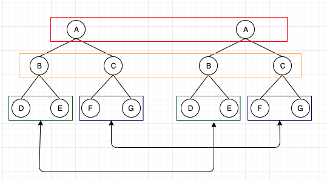
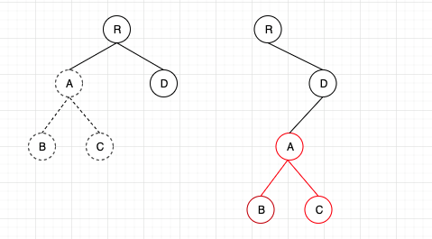
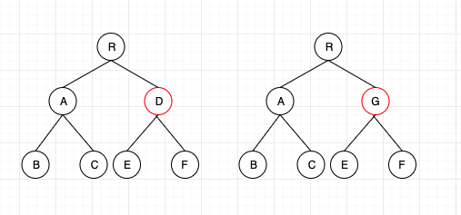
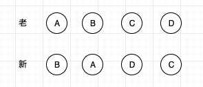
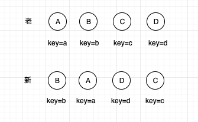
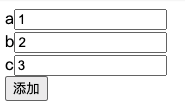
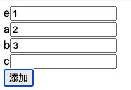

# React Diff 算法

[react diff 算法详解](https://zhuanlan.zhihu.com/p/20346379)

## diff 策略

1.两个相同组件会生成相同的树形结构，不同组件会生成不同树形结构 2.同一层级的一组子节点，通过唯一 id 进行区分

### tree diff (DOM 节点比较)



react diff 只会对相同颜色框内的节点进行比较，即同一个父节点下所有子节点。如果发现节点不存在，则改节点
及其子节点会被完全删除，不会进行进一步比较，这样只需要遍历一次，就能完成整个 DOM 树的比较

**以上是同层级的比较，如果出现节点跨层级移动，情况又会如何 **

如下，节点 A 被整个移动到节点 D 的下面，由于 React 只会比较同级节点，当发现 A 节点没有了，则会删除 A 节点，
而发现 D 节点下多额 A 节点，则会创建 A 节点，因此 React diff 执行顺序为:

> createA -> createB -> createC -> deleteA



由此可见，跨节点层级移动时，节点是被整个重新创建，因此这是一种影响 React 的性能操作，官方也建议:

**不要进行 DOM 节点跨层级的操作**

> 注意：在开发组件时，保持稳定的 DOM 结构会有助于性能提升。例如可以通过 CSS 来隐藏和显示节点，而不是移除或添加 DOM 节点

### component diff (组件比较)

1.如果是同一类型的组件，会按照原策略比较 virtual DOM tree 2.如果不是，则直接替换整个组件下的所有子节点 3.对于同一类型组件，其 Virtual DOM 可能没有任何变化，如果能准确的知道这点，便可节省大量 diff 的时间
因此 React 允许用户通过 shouldComponentUpdate 来判断该组件是否需要 diff

还有一种情况，如下图, 组件 D 改变为 G 时，尽管 2 个组件结构相似，但 React 任然认为 D 和 G 是不同类型的组件，
会直接删除 D，重新创建 G 及其子节点。很显然这一操作会影响性能，但如 React 官方博客所言：不同类型的组件
很少有相似的 DOM tree 机会，因此这种情况可以忽略



### element diff



如上图，在列表渲染时，原列表 A-B-C-D，更新后成 B-A-D-C，在进行 diff 时，React 认为 B != A,
会直接在新列表上创建 A，而删除老列表的 B，一次类推 A-D-C 都是如此操作，但其实他们只是位置边换了，并不
需要创建和删除，于是 React 给每个节点设置可一个 key 如下图



React 通过 key 发现新老集合中的节点是相同的，只需要将位置变换一下即可，因此便不用去 diff，
从而提升了性能，这也是为什么 React 要求给每个列表项加 key 的原因

### 使用 index 作为 key 的一些问题

```html
<div>
  {list.map((item, index) => (
  <div>{item}<input key="{index}" /></div>
  ))}
  <button onClick="{handleAdd}">添加</button>
</div>
```



当点击添加在顶部插入一条数据 e 的时候如下：
输入框中的数据错位了



因为 e 的 key 此时等于 0 ，而之前 key = 0 时的值是 a 的值 1，所以此时 e 的值等于 1，
因此用 index 做 key 在某些情况会出现数据错乱情况，应该尽量避免，保持 key 是唯一且稳定的
