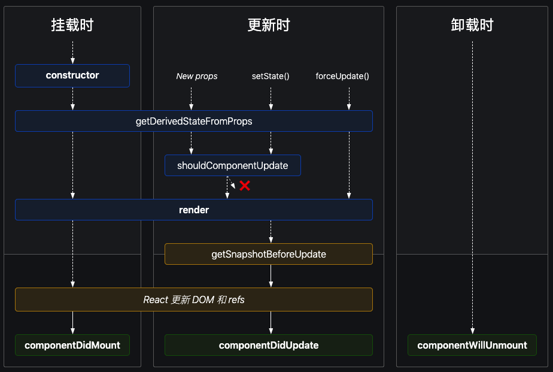

# 生命周期

react 组件的生命周期主要发生在 3 个部分，挂载，更新，卸载。

## 挂载

- constructor()
- static getDerivedStateFromProps()
- render()
- componentDidMount()

## 更新

- static getDerivedStateFromProps()
- shouldComponentUpdate()
- render()
- getSnapshotBeforeUpdate()
- componentDidUpdate()

## 卸载

- componentWillUnmount()

## 错误处理

- static getDerivedStateFromError()
- componentDidCatch()

## 以下生命周期方法将过时

- componentWillMount()
- componentWillUpdate()
- componentWillReceiveProps()

## 讲解

- 组件被创建时，分别调用 `constructor, getDerivedStateFromProps, render , componentDidMount`
- 当更新 `props` 和 `state` 时，分别调用 `getDerivedStateFromProsp`，根据 `shouldComponentUpdate` 返回 `true or false`
  来决定是否渲染页面, 返回 `true` 执行 `render` ，然后再调用 `getSnapshotBeforeUpdate , componentDidUpdate`
- 组件卸载时直接调用 `componentWillUnmount`

