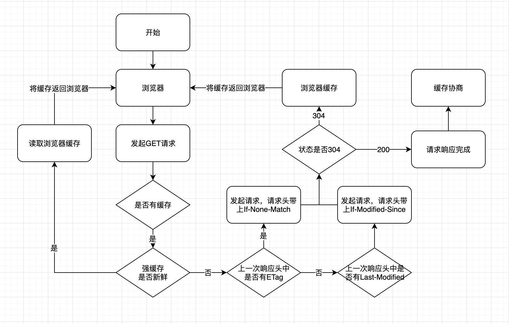
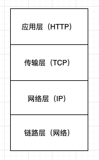
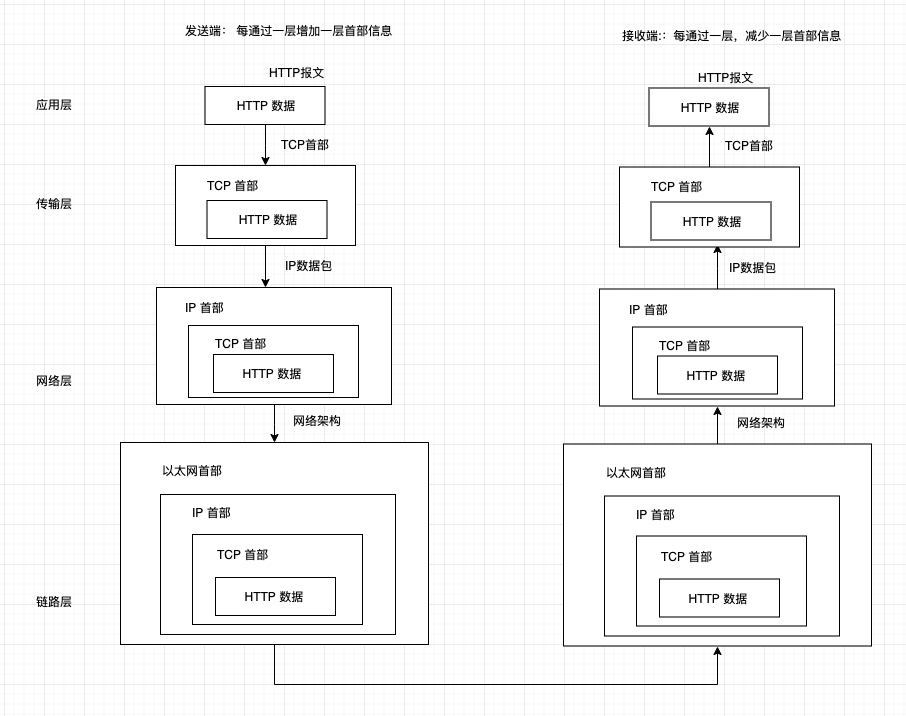
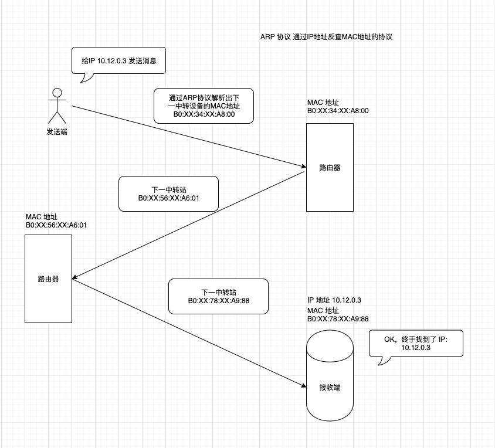
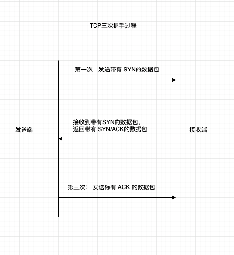
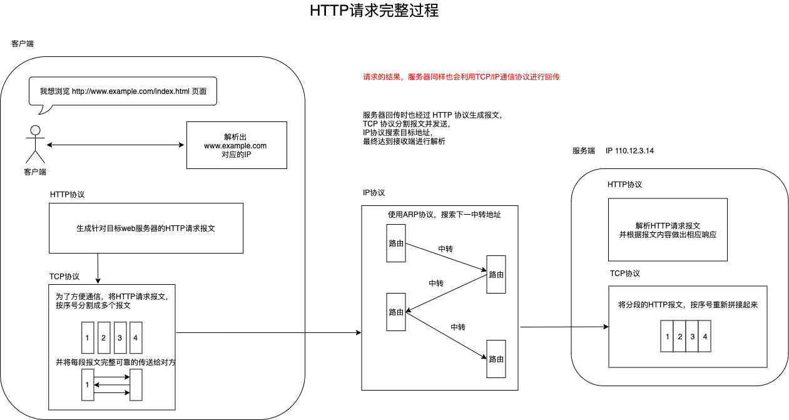

# HTTP/TCP 相关知识点

## Http

**超文本传输协议(HTTP)** 是一个用于传输超媒体文档(例如 HTML)的 **应用层** 协议；

### 请求方法

- GET：获取数据
- POST：提交数据
- HEAD：获取报文首部信息，不返回报文主体信息
- PUT：传输文件，由于 HTTP/1.1 的 PUT 方法自身不带验证机制，因此任何人都可以上传文件，不安全，如果框架采用 REST 标准，便可使用
- DELETE：与 PUT 一样，没有验证机制，需要配合 REST 来使用
- OPTIONS：查询针对请求 URI 指定的资源支持的方法
- TRACE：追踪路径，在 Max-Forwards 首部字段中填入数值，每经过一个服务器端该数值就减 1，当数值为 0 时，停止继续传输，并当前服务器端则返回 200 OK 响应，但是容易引起 XST（Cross Site Tracing 跨站追踪）攻击，通常不会使用
- connect

### get 和 post 的区别

|              | GET                               | POST                                                  |
| ------------ | --------------------------------- | ----------------------------------------------------- |
| 缓存         | 能被缓存                          | 不能缓存                                              |
| 编码         | application/x-www-form-urlencoded | application/x-www-form-urlencoded multipart/form-data |
| 历史         | 参数能保留在浏览器历史中          | 不能                                                  |
| 目的         | 请求目标资源                      | 向目标资源提交数据                                    |
| 数据长度限制 | url 最大长度 2048 个字符          | 无限制                                                |
| 数据类型限制 | 只允许 ASCII 字符                 | 没有限制。也允许二级制数据                            |
| 安全性       | 数据都暴露在浏览器地址栏中        | 相对 GET 比较安全                                     |

### 持久连接（管线化）

由于每发起一次 http 请求就要建立一次 tcp 连接，请求响应结束后，tcp 连接又会断开，造成很大的通信开销。
所以为了减少 tcp 连接的次数 (HTTP keep-alive)

管线化能够**同时并行**发送多个请求，不必等待响应

### Cookie 状态管理

服务端响应首部返回 Set-Cookie: token=123 字段，客户端接收到之后，下次请求自动在请求头中加入 Cookie: token=123

### Http 报文

内容编码
gzip
compress （unix 系统的标准压缩）
deflate (zlib)
identity (不进行编码)

分块传输编码
传输大容量数据时，通过将数据分割成多块，每块用 16 进制来标记大小，而最后一块用 “0（CR+LF）来标记结束”，

http 发送多种类型的数据，文本，图片，视频等，通过在 Content-Type 中设置如下属性

### multipart/form-data (表单方式)

// 省略其他请求头
Content-Type:multipart/form-data; boundary=--------------------------028805979780746365531083
// 以下是请求主体(已当前空行开始)
--------------------------028805979780746365531083
Content-Disposition: form-data; name="name"

a98k
--------------------------028805979780746365531083
Content-Disposition: form-data; name='tel'

18322321123
--------------------------028805979780746365531083
Content-Dispostion: form-data; name='file'; filename='1.txt'
Content-Type: text/plain

...(文件的内容)...
--------------------------028805979780746365531083-- // 结束分隔符

### multipart/bytesranges

响应报文包含多个范围的内容时使用

// ... 以上相同，此处省略

--------------------------028805979780746365531083
Content-Type: application/pdf
Content-Range: bytes 500-1000/3000

...(指定范围内的数据)...
--------------------------028805979780746365531083
Content-Type: application/pdf
Content-Range: bytes 2000-2999/3000

...(指定范围内的数据)...
--------------------------028805979780746365531083--

### 什么是代理？

代理是一种有转发功能的应用程序，接受客户端请求转发个服务器，同时接受服务器请求转发给客户端；
每次经过代理服务器，会加入 Via 首部信息

#### 代理服务器

可以利用缓存技术（缓存源服务器上的资源保存到代理服务器），减少宽带，节省流量，对内部特定网站进行访问控制，
以获取访问日志为主要目的，对报文进行加工的称为非透明代理，反之称为透明代理。

### 什么是网关？

网关是转发其他服务器通信数据的服务器，接收客户端的请求，并可以对请求进行处理；
利用网关可以将 HTTP 请求转化为其他通信协议，网关的机制与代理很类似，但网关可以使通信线路上的服务器提供非 HTTP 的协议服务
利用网关能提高通信安全，在客户端与网关直接的通信线路上加密确保链接安全，网关可链接数据库，银行结算系统等。

## HTTP 首部

### 通用首部字段

| 名称              | 值(示例)                      | 说明                       |
| ----------------- | ----------------------------- | -------------------------- |
| Cache-Control     | no-cache                      | 控制缓存的行为             |
| Connection        | keep-alive                    | 连接方式                   |
| Date              | Mon, 20 Jul 2020 10:18:58 GMT | 创建报文的时间             |
| Pragma            | no-cache                      | 报文指令                   |
| Trailer           |                               | 报文末端的首部             |
| Transfer-Encoding |                               | 指定报文主体的传输编码方式 |
| Upgrade           |                               | 升级为其他协议             |
| Via               |                               | 代理服务器相关信息         |
| Warning           |                               | 错误通知                   |

### 请求首部字段

| 名称                | 值（示例） | 说明                                            |
| ------------------- | ---------- | ----------------------------------------------- |
| Accept              | text/plain | 用户代理可处理的媒体类型                        |
| Accept-Charset      |            | 优先的字符集                                    |
| Accept-Encoding     |            | 优先的内容编码                                  |
| Accept-Language     |            | 优先的语言                                      |
| Authorization       |            | web 认证信息                                    |
| Expect              |            | 期待服务器的特定行为                            |
| From                |            | 用户的电子邮箱地址                              |
| Host                |            | 请求资源所在服务器                              |
| If-Match            |            | 比较实体标记（ETag）                            |
| If-Modified-Since   |            | 比较资源的更新时间                              |
| If-None-Match       |            | 比较实体标记（与 If-Match 相反）                |
| If-Range            |            | 资源未更新时，发送实体 Byte 的范围              |
| If-Unmodified-Since |            | 比较资源的更新时间（与 If-Modified-Since 相反） |
| Max-forwards        |            | 最大传输跳帧数                                  |
| Proxy-Authorization |            | 代理服务器要求客户端的认证信息                  |
| Range               |            | 实体的字节范围请求                              |
| Referer             |            | 请求 URL 的原始发起方                           |
| TE                  |            | 传输编码的优先级                                |
| User-Agent          |            | HTTP 客户端程序信息                             |

### 响应首部字段

| 名称               | 值（示例） | 说明                         |
| ------------------ | ---------- | ---------------------------- |
| Accept-Ranges      |            | 是否接受字节范围请求         |
| Age                |            | 推算资源创建经过时间         |
| ETag               |            | 资源的唯一标识信息           |
| Location           |            | 指定客户端重定向的 URI       |
| Proxy-Authenticate |            | 代理服务器对客户端的认证信息 |
| Retry-After        |            | 再次发起请求的时机要求       |
| Server             |            | HTTP 服务器的安装信息        |
| Vary               |            | 代理服务器缓存的管理信息     |
| WWW-Authenticate   |            | 服务器对客户端的认证信息     |

### 实体首部字段

| 名称             | 值（示例） | 说明                   |
| ---------------- | ---------- | ---------------------- |
| Allow            |            | 资源可支持的 HTTP 方法 |
| Content-Encoding |            | 实体主体适用的编码方式 |
| Content-Language |            | 实体主体的自然语言     |
| Content-Length   |            | 实体主体的大小         |
| Content-Location |            | 替代对应资源的 URI     |
| Content-MD5      |            | 实体主体的报文摘要     |
| Content-Range    |            | 实体主体的位置范围     |
| Content-Type     |            | 实体主体的媒体类型     |
| Expires          |            | 实体主体过期的日期时间 |
| Last-Modified    |            | 资源的最后修改日期时间 |

请求报文和响应报文实体部分只用的首部。

### 非正式首部字段

| 名称                | 值（示例） | 说明                     |
| ------------------- | ---------- | ------------------------ |
| Cookie              |            | 发送请求时的 cookie 信息 |
| Set-Cookie          |            | 服务端返回的 cookie 信息 |
| Content-Disposition |            |                          |

### Cache-Control

控制缓存的行为，有关缓存详细接受，查看 [HTTP 缓存](https://app.yinxiang.com/shard/s37/nl/28748643/7db00ab1-4862-4c10-bcb1-f12e013c1615/)

> Cache-Control: private, max-age=0,no-cache

#### 缓存请求指令

| 指令           | 参数       | 说明                                                       |
| -------------- | ---------- | ---------------------------------------------------------- |
| no-cache       | -          | 强制向源服务器再次验证                                     |
| no-store       | -          | 不缓存任何请求或响应的任何内容                             |
| max-age        | 秒         | 设置缓存存储的最大周期，超过这个时间缓存被认为过期         |
| max-stale      | 秒（可选） | 表示客户端愿意接受一个过期资源，但是不能超过给定的时间     |
| min-fresh      | 秒         | 客户端希望获取一个能再指定秒数内保持最新状态的响应         |
| only-if-cached | -          | 客户端只接受缓存，并且不要向原始服务器检查是否有更新的拷贝 |
| no-transform   | -          | 不得对资源进行转换或转变                                   |

### Connection

- 管理连接状态，是关闭（close） 还是保持持久（keep-alive）
- 控制不再转发给代理服务器的首部字段（除去 Keep-Alive, Transfer-Encoding, TE, Connection,Trailer,Upgrade,Proxy-Authorization, Proxy-Ahtuenticate 这些逐段传输头，其他任何逐段传输头都要在 Connection 中定义）

### Pragma

> Pragma: no-cache

要求所有中间服务器不返回缓存资源，向下兼容所有 HTTP 协议版本，与 Cache-Control:no-cache 一样

## 状态码类别

| CODE | 类别         | 说明                                   |
| ---- | ------------ | -------------------------------------- |
| 1XX  | 信息性状态码 | 请求正在处理                           |
| 2XX  | 成功状态码   | 请求正常处理完毕                       |
| 3XX  | 重定向状态码 | 需要进行附加操作以完成请求             |
| 4XX  | 客户端错误   | 服务器无法处理请求（客户端配置有问题） |
| 5XX  | 服务端错误   | 服务器处理请求出错                     |

### 2XX 成功

- 200 OK：表示请求被服务器正常处理；
- 204 No Content：请求已成功处理，但在响应报文中不含实体的主体部分。另外也不允许返回任何实体的主体，因此浏览器在接收到 204 后，页面不会发生更新。
- 206 Partial Content：客户端进行了范围请求，服务器根据 Content-Range 指定的范围返回实体内容

### 3XX 重定向

- 301 Moved Permanently: 永久重定向。表示请求的资源被分配了新的 URI，Location 首部字段会返回新的 URI 地址
- 302 Found: 临时重定向。与 301 类似，但只是临时性质的，被移动的资源对应的 URI 在将来还有可能发生改变
- 303 See Other: 表示请求的资源存在另一个 URI，并要求使用 GET 方法来访问
- 304 Not Modified: 客户端发送附带条件的请求时，服务端允许请求访问资源，但未满足条件的情况下返回 304。（缓存常见）
- 307 Temporary Redirect：临时重定向，与 302 含义相同

### 4XX 客户端错误

- 400 Bad Request: 请求报文中存在语法错误
- 401 Unauthorized: 请求未认证
- 403 Forbidden: 请求的资源被服务器拒绝了
- 404 Not Found: 请求的资源不存在

### 5XX 服务器错误

- 500 Internal Server Error: 服务器在执行请求时发生错误
- 503 Service Unavailable: 暂时无法处理请求，服务器可能处于超负载或正在停机维护

## Http 缓存

浏览器缓存分为 **强缓存** 和 **协商缓存** 2 种

### 强缓存

#### Expiress

系统时间超过这个值，缓存失效，由于当前系统时间和服务器时间有不一致情况，所以缓存有效期不准的问题，优先级最低

#### Cache-Control

Cahce-Control 是 HTTP/1.1 中新增的属性，在请求头和响应头中都可以使用，常用属性如下:

- **max-age:** 单位秒，设置缓存最大时长
- **no-cache**: 不使用强缓存，需要与服务器验证缓存是否新鲜
- **no-store**: 禁止使用缓存（包括协商缓存）, 每次都向服务器请求最新的资源
- **public**: 表示改响应可以被任何中间人（中间代理、CDN 等）缓存
- **private**: 专用某单个用户，中间人（中间代理、CDN 等）不能缓存次响应，该响应只能应用于浏览器私有缓存中
- must-revalidate: 使用这个指令，意味着缓存在考虑使用一个陈旧的资源时，必须先验证它的状态，已过期的缓存将不被使用

#### Pragma

`Pragma` 只有一个属性值: `no-cache`, 效果和 `Cache-Control` 中的 `no-cache` 一致，HTTP 响应头中没有明确定义这个属性，所以不能拿来完全替代 `Cache-Control` ，当 `Cache-Control` 和 `Pragma` 同时存在时，`Pragma` 优先

### 协商缓存

#### Last-Modified/If-Modified-Since

`Last-Modified` 响应头是一种弱校验器，因为它只能精确到 1 秒，客户端首次请求的时候，服务端会把文件的最后一次修改的时间放在响应头 `Last-Modified` 中，下次客户端再次请求的时候，会把这个时间放在请求头中的 `If-Modified-Since` 中，服务端比较 `If-Modified-Since` 的时间与文件最后一次修改的时间是否相等，相等则返回 304 告诉浏览器使用本地缓存，304 的响应头可以更新文档的过期时间，但如果我对一个文件添加或删除一个空格，实则内容没有发生任何变化， `Last-Modified/If-Modified-Since` 这种模式服务端会错误的返回 200，认为你这个资源需要重新加载

#### ETag/If-None-Match

`ETag/If-None-Match` 的值是一串 hash 码，代表的是一个资源的标识符，当服务端文件变化时，这个值会随之变化，通过请求头中的 `If-None-Match` 值与文件的 hash 值进行比较，相等则返回 304 .然而 `ETag` 又有强弱之分，若 hash 值以 **'W/'** 开头，此时你删除或添加一个空格，还是会造成 ETag 的值发生变化，从而导致重新加载资源，为了解决这个问题，一般手动设置 ETag 的值，以文件 MD5 的值作为 ETag 的值，此时无论你对文件添加或删除空格，都不会改变 MD5 值，因此服务端会返回 304, 告诉浏览器使用本地缓存

### Cookie

cookie 有两种类型，会话期和持久性，会话期 cookie 关闭浏览器后自动删除，持久性 cookie 可以通过 Expires 和 Max-Age 来
设置失效时间，且设置的时间只与客户端相关

> `Set-Cookie: <name>=<value>;...;<name>=<value>`

## HTTPS

https = http + SSL (加密 + 认证 + 完整性保护)

之前是 应用层（HTTP）直接和传输层（TCP）进行通信，使用 SSL 之后， HTTP -> SSL -> TCP

### SSL 加密原理

SSL 采用一种叫做 **公开秘钥加密** 方式，也就是 **非对称加密** 方式，由于在通信传输过程中，
无法证明收到的加密秘钥是原始服务器的公开秘钥，在传输过程中有可能被替换，为了解决上述问题，CA 证书由此诞生

## TCP

TCP/IP 是互联网相关的各类协议族的总称

### 分层

- 应用层：向用户提供应用服务时通信的活动（如:DNS,FTP）HTTP 协议也处于该层
- 传输层：对上层应用层，提供网络连接中 2 台计算机之间的数据传输，（如：TCP 传输控制协议, UDP 用户数据报协议）
- 网络层（网络互连层）：用来处理网络上流动的数据包（网络传输的最小数据单位）。该层规定了通过怎样的路径到达对方计算机，并把数据包传送给对方。与对方计算机之间通过多台计算机或网络设备进行传输时，网络层的作用就是在众多的路线中选择一条传输路线。
- 数据链路层（网络接口层）：用来处理连接网络的硬件部分。包括操作系统，硬件的设备驱动，NIC(网络适配器，即网卡)，及光纤等物理可见部分。硬件上的范畴均在链路层的作用范围之内。

### 通信传输过程

在这个传输过程中，传输层（TCP 协议）会把应用层接受到的数据（HTTP 报文）进行分割，并在被分割的报文上标记序号和端口转发给网络层；
网络层（IP 协议）增加作为通信目的地的 MAC 地址后转发给链路层，这样发往网络的通信请求就准备完成了，当接收端一层一层解析后，到达应用层，这才算真正接收到客户端发送过来的 HTTP

### IP 协议

IP 协议的作用是把各种数据包传递给对方，如何确保确实传送成功，这里有 2 个重要条件 IP 地址 和 Mac 地址。
IP 地址是节点被分配到的地址，MAC 地址是网卡所属的固定地址，IP 地址和 MAC 地址可进行配对（MAC 地址不会更改）
IP 间的通信依赖于 MAC 地址，在网络通信中，要经过多台计算机或者网络设备进行中转，在中转时，通过中转设备的 MAC 地址来搜索下一中转目标，通过多次中转，最终找到目标 IP 的 MAC 地址。
这个过程中通过 ARP 协议可以根据 IP 地址可以反查出对应的 MAC 地址

### TCP 协议

提供可靠的字节流服务，通过把大块数据分割成以报文段为单位的数据包进行管理，并将**数准确可靠**的传给对方
为了确保数据成功送达目标处,TCP 协议采用三次握手策略

### DNS 域名解析

与 HTTP 协议一样是位于应用层的协议，提供域名到 IP 地址之间的解析服务

### HTTP 通信完整过程

